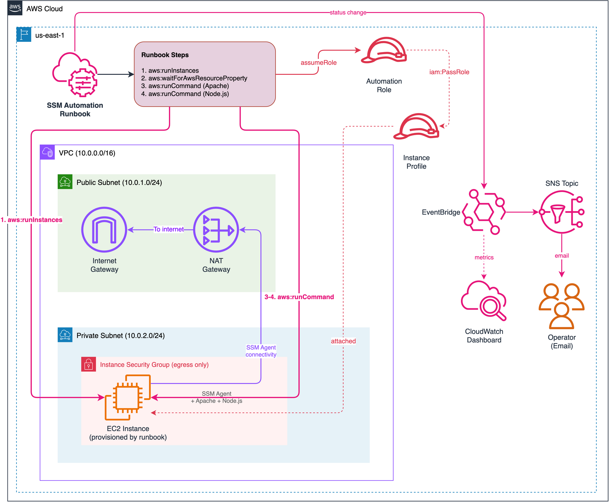
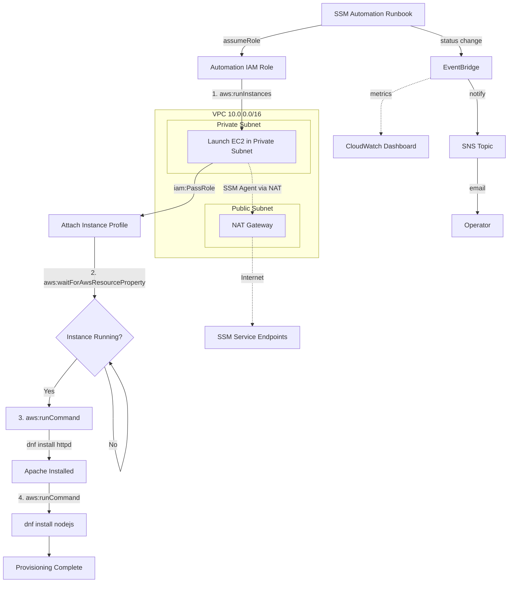

# Lab 01: Automation Runbook — EC2 Provisioning

Create a multi-step SSM Automation runbook that provisions an EC2 instance, waits for it to reach running state, then installs Apache and Node.js via Run Command.

## Objective

- Build an SSM Automation runbook with multiple orchestrated steps
- Launch an EC2 instance programmatically using `aws:runInstances`
- Wait for instance readiness using `aws:waitForAwsResourceProperty`
- Install software packages via `aws:runCommand` (Run Command integration)
- Pass outputs between steps using `{{ StepName.OutputKey }}` syntax

## Architecture



> To edit the diagram, open [`architecture.drawio`](./architecture.drawio) in [draw.io](https://app.diagrams.net/). Export as PNG to update `architecture.png`.

### Execution Flow



## SSM Automation Steps

| Step | Action | What It Does |
|---|---|---|
| 1. RunInstances | `aws:runInstances` | Launch EC2 instance with specified AMI, instance type, and instance profile |
| 2. WaitForInstanceRunning | `aws:waitForAwsResourceProperty` | Poll until instance state is `running` |
| 3. InstallApache | `aws:runCommand` | Execute `dnf install -y httpd` and start the service |
| 4. InstallNode | `aws:runCommand` | Execute `dnf install -y nodejs` from AL2023 default repos |

## Key Concepts Demonstrated

- **Step output passing:** `{{ RunInstances.InstanceIds }}` feeds into subsequent steps
- **Automation document (YAML):** Declarative runbook definition managed as Terraform resource via `yamlencode()`
- **Run Command integration:** Automation can invoke Run Command as a step, combining orchestration with ad-hoc execution
- **Instance profile requirement:** Target EC2 must have SSM Agent connectivity for Run Command steps
- **Fully parameterized:** All inputs (AMI, subnet, instance profile, SG, instance type, name) are SSM document parameters with defaults resolved from Terraform outputs
- **Amazon Linux 2023:** Uses `dnf` (not `yum`); Node.js from AL2023 default repos (not deprecated nodesource curl)

## Resources Created

| Resource | Purpose |
|---|---|
| VPC + public/private subnets | Network isolation for launched instances |
| Internet Gateway | Public subnet internet access |
| NAT Gateway + EIP | Private subnet outbound (SSM Agent connectivity) |
| Instance Security Group | Egress-only SG attached to runbook instances |
| IAM Role (EC2 trust) | Instance profile for SSM Agent connectivity |
| IAM Instance Profile | Passed to `aws:runInstances` step |
| IAM Role (SSM trust) | Automation assume role with ec2:RunInstances, ssm:SendCommand |
| SSM Document (Automation) | 4-step runbook: launch, wait, install Apache, install Node.js |
| SNS Topic | Automation execution notifications |
| EventBridge Rule | Detects SSM Automation execution status changes |
| CloudWatch Dashboard | Operational metrics (events, notifications, health) |

## Deployment

### Prerequisites

- Terraform >= 1.5
- AWS CLI v2 configured with admin-level credentials
- Region: `us-east-1`

### Steps

```bash
cd infrastructure/terraform

# Copy and edit variables
cp terraform.tfvars.example terraform.tfvars
# Edit terraform.tfvars as needed

# Deploy
terraform init
terraform plan
terraform apply
```

### Validation

```bash
# Execute the automation runbook
RUNBOOK_NAME=$(terraform output -raw runbook_name)
aws ssm start-automation-execution \
  --document-name "$RUNBOOK_NAME" \
  --region us-east-1

# Wait 3-5 minutes, then check execution status
aws ssm describe-automation-executions \
  --filters Key=DocumentNamePrefix,Values="$RUNBOOK_NAME" \
  --region us-east-1

# Verify the provisioned instance
aws ec2 describe-instances \
  --filters "Name=tag:ManagedBy,Values=ssm-automation" \
  --query "Reservations[].Instances[].[InstanceId,State.Name]" \
  --output table --region us-east-1
```

### Verify Installations

After the automation completes, verify that Apache and Node.js were installed on the provisioned instance using Run Command (no SSH required):

```bash
# Get the provisioned instance ID
INSTANCE_ID=$(aws ec2 describe-instances \
  --filters "Name=tag:ManagedBy,Values=ssm-automation" "Name=instance-state-name,Values=running" \
  --query "Reservations[0].Instances[0].InstanceId" --output text --region us-east-1)

# Verify Apache and Node.js via Run Command
COMMAND_ID=$(aws ssm send-command \
  --instance-ids "$INSTANCE_ID" \
  --document-name "AWS-RunShellScript" \
  --parameters 'commands=["sudo systemctl status httpd --no-pager","node --version"]' \
  --query "Command.CommandId" --output text --region us-east-1)

# Wait a few seconds, then retrieve the output
aws ssm get-command-invocation \
  --command-id "$COMMAND_ID" \
  --instance-id "$INSTANCE_ID" \
  --query "{Status:Status,Output:StandardOutputContent}" \
  --region us-east-1
```

Expected output shows `httpd` as `active (running)` and a Node.js version string (e.g., `v18.x.x`).

Alternatively, connect interactively via Session Manager:

```bash
aws ssm start-session --target "$INSTANCE_ID" --region us-east-1
# Then run: sudo systemctl status httpd --no-pager && node --version
```

> **Note:** The `aws ssm start-session` command requires the [Session Manager plugin for the AWS CLI](https://docs.aws.amazon.com/systems-manager/latest/userguide/session-manager-working-with-install-plugin.html). Install it before using interactive sessions.

### Teardown

```bash
# IMPORTANT: Terminate runbook-created instances first (outside Terraform state)
INSTANCE_ID=$(aws ec2 describe-instances \
  --filters "Name=tag:ManagedBy,Values=ssm-automation" "Name=instance-state-name,Values=running" \
  --query "Reservations[0].Instances[0].InstanceId" --output text --region us-east-1)
aws ec2 terminate-instances --instance-ids "$INSTANCE_ID" --region us-east-1

# Then destroy Terraform-managed infrastructure
terraform destroy
```

> **Note:** The automation runbook creates EC2 instances outside of Terraform state. Always terminate runbook-created instances (tagged `ManagedBy=ssm-automation`) before running `terraform destroy`.

## Cost Estimate

| Component | Estimated Monthly Cost |
|---|---|
| NAT Gateway (for SSM connectivity) | ~$32/month |
| EC2 t2.micro (provisioned by runbook) | ~$7.50/month |
| SSM Automation executions | Free |
| S3 storage (logs) | ~$0.10/month |
| EventBridge rules | Free |
| SNS notifications | Free tier |
| CloudWatch Dashboard | Free (up to 3 dashboards) |
| **Total** | **~$40/month** |

Always run `terraform destroy` when done to stop NAT gateway charges.

## Enhancement Layers

- [x] Layer 1: Infrastructure as Code (Terraform) — this lab
- [x] Layer 2: CI/CD Pipeline (GitHub Actions for terraform fmt/validate)
- [x] Layer 3: Monitoring (EventBridge rule, SNS notifications, CloudWatch dashboard)
- [ ] Layer 4: Finance Domain Twist (Runbook for provisioning financial data processing instances)
- [ ] Layer 5: Multi-Cloud Extension (Azure Automation Runbook equivalent)
