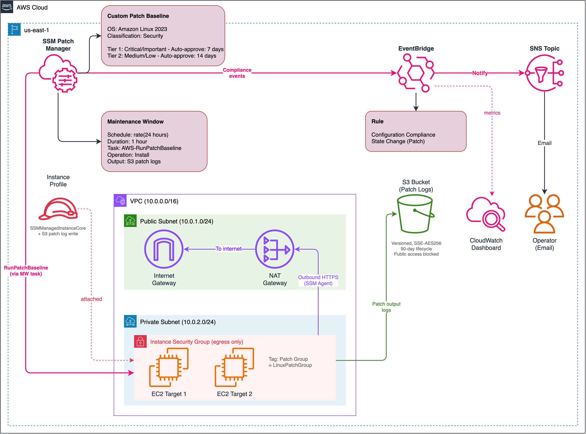
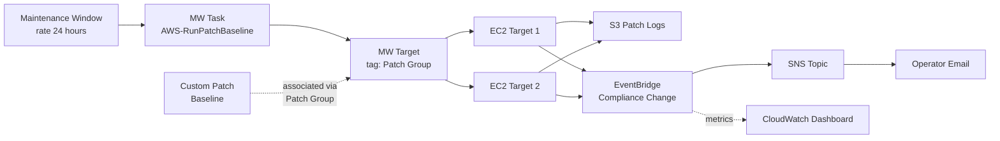
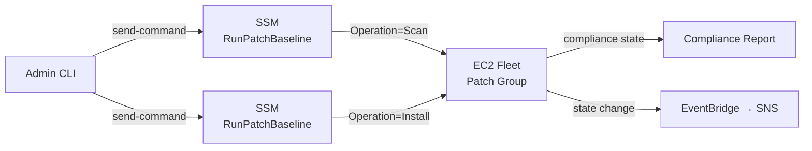

# Lab 02: Patch Manager — Compliance Baseline

Configure AWS Systems Manager Patch Manager to scan and patch a fleet of EC2 instances on a schedule, using a custom patch baseline with tiered approval rules, patch groups, maintenance windows, and event-driven compliance notifications.

## Objective

- Create a custom patch baseline for Amazon Linux 2023 with tiered approval rules (Critical/Important: 7 days, Medium/Low: 14 days)
- Organize instances into a patch group using the `Patch Group` EC2 tag
- Deploy a fleet of 2 EC2 instances in a private subnet to demonstrate fleet-wide patching
- Configure a maintenance window with a scheduled `AWS-RunPatchBaseline` task
- Store patch execution output in a versioned, encrypted S3 bucket with lifecycle policies
- Detect compliance state changes via EventBridge and notify operators via SNS
- Demonstrate both on-demand scan and scheduled scan-and-install workflows

## Architecture



> To edit the diagram, open [`architecture.drawio`](./architecture.drawio) in [draw.io](https://app.diagrams.net/). Export as PNG to update `architecture.png`.

### Patching Flow



### On-Demand Patching Flow



## Patch Manager Components

| Component | Purpose |
|---|---|
| Custom Patch Baseline | Defines which patches are approved for AL2023, with tiered auto-approval delays and compliance severity levels |
| Patch Group | Tag-based grouping (`Patch Group = LinuxPatchGroup`) that associates instances with the custom baseline |
| Maintenance Window | Scheduled time window (`rate(24 hours)`, 1-hour duration) for automated patching operations |
| Maintenance Window Task | `AWS-RunPatchBaseline` document executed during the window with S3 output logging |
| S3 Patch Logs | Versioned, encrypted bucket for patch execution output with 90-day lifecycle |
| EventBridge Rule | Detects `Configuration Compliance State Change` events for patch compliance |
| SNS Topic | Notification channel for compliance change alerts (optional email subscription) |

## Resources Created

| Resource | Type | Purpose |
|---|---|---|
| `module.ssm_vpc` | VPC + subnets + NAT | Network infrastructure with private subnet internet access |
| `aws_s3_bucket.patch_logs` | S3 Bucket | Patch execution log storage |
| `aws_s3_bucket_versioning.patch_logs` | S3 Versioning | Enable versioning on patch log bucket |
| `aws_s3_bucket_lifecycle_configuration.patch_logs` | S3 Lifecycle | Auto-expire logs after 90 days |
| `aws_s3_bucket_server_side_encryption_configuration.patch_logs` | S3 Encryption | AES-256 server-side encryption |
| `aws_s3_bucket_public_access_block.patch_logs` | S3 Public Access | Block all public access |
| `aws_iam_policy.patch_log_write` | IAM Policy | S3 write permission for instance role |
| `module.ssm_instance_profile` | IAM Role + Profile | SSMCore + S3 patch log write |
| `aws_instance.patch_target` (x2) | EC2 Instance | Patch target fleet tagged with Patch Group |
| `aws_ssm_patch_baseline.al2023_security` | Patch Baseline | Custom AL2023 baseline with tiered approval rules |
| `aws_ssm_patch_group.linux_patch_group` | Patch Group | Associates baseline with patch group tag |
| `aws_ssm_maintenance_window.patching` | Maintenance Window | Scheduled patching window |
| `aws_ssm_maintenance_window_target.patch_group_instances` | MW Target | Tag-based instance targeting |
| `aws_iam_role.maintenance_window` | IAM Role | SSM service role for MW tasks |
| `aws_iam_role_policy.maintenance_window` | IAM Policy | SendCommand, S3, SNS permissions |
| `aws_ssm_maintenance_window_task.run_patch_baseline` | MW Task | Executes AWS-RunPatchBaseline |
| `aws_sns_topic.patch_notifications` | SNS Topic | Patch compliance notification channel |
| `aws_sns_topic_policy.eventbridge_publish` | SNS Policy | Allow EventBridge to publish |
| `aws_sns_topic_subscription.email` | SNS Subscription | Optional email subscription |
| `aws_cloudwatch_event_rule.patch_compliance_change` | EventBridge Rule | Compliance state change detection |
| `aws_cloudwatch_event_target.patch_compliance_sns` | EventBridge Target | Route events to SNS |
| CloudWatch Dashboard | CloudWatch Dashboard | Operational metrics for patch compliance events |

## Deployment

### Prerequisites

- Terraform >= 1.5
- AWS CLI v2 configured with admin-level credentials
- Region: `us-east-1`

### Steps

```bash
cd infrastructure/terraform

# Copy and edit variables
cp terraform.tfvars.example terraform.tfvars
# Edit terraform.tfvars as needed

# Deploy
terraform init
terraform plan
terraform apply
```

### Validation

After deployment, wait 1-2 minutes for SSM Agent to register the instances, then run these checks:

```bash
# Verify instances registered with SSM
aws ssm describe-instance-information \
  --region us-east-1 \
  --query "InstanceInformationList[*].[InstanceId,PingStatus,PlatformName]" \
  --output table

# Check custom patch baseline
aws ssm describe-patch-baselines \
  --filters "Key=NAME_PREFIX,Values=$(terraform output -raw patch_baseline_name)" \
  --region us-east-1

# Check patch group association
aws ssm describe-patch-groups --region us-east-1

# Check maintenance window
aws ssm describe-maintenance-windows \
  --filters "Key=Name,Values=$(terraform output -raw maintenance_window_name)" \
  --region us-east-1
```

### On-Demand Patch Scan

```bash
# Scan only (check compliance without installing)
aws ssm send-command \
  --document-name "AWS-RunPatchBaseline" \
  --targets "Key=tag:Patch Group,Values=$(terraform output -raw patch_group_name)" \
  --parameters "Operation=Scan" \
  --output-s3-bucket-name "$(terraform output -raw patch_log_bucket_name)" \
  --output-s3-key-prefix "on-demand-scan/" \
  --region us-east-1

# Check command status
COMMAND_ID=$(aws ssm list-commands --region us-east-1 \
  --query "Commands[0].CommandId" --output text)
aws ssm list-command-invocations \
  --command-id "$COMMAND_ID" \
  --details \
  --region us-east-1

# Check patch compliance state
aws ssm describe-instance-patch-states \
  --instance-ids $(terraform output -json patch_target_instance_ids | jq -r '.[]') \
  --region us-east-1
```

### On-Demand Patch Install

```bash
# Scan and install patches
aws ssm send-command \
  --document-name "AWS-RunPatchBaseline" \
  --targets "Key=tag:Patch Group,Values=$(terraform output -raw patch_group_name)" \
  --parameters "Operation=Install" \
  --output-s3-bucket-name "$(terraform output -raw patch_log_bucket_name)" \
  --output-s3-key-prefix "on-demand-install/" \
  --region us-east-1
```

### Teardown

```bash
terraform destroy
```

## Cost Estimate

| Component | Estimated Monthly Cost |
|---|---|
| NAT Gateway (for SSM connectivity) | ~$32/month |
| EC2 t2.micro instances (2x) | ~$15/month |
| SSM Patch Manager | Free |
| Maintenance Windows | Free |
| S3 storage (patch logs) | ~$0.10/month |
| EventBridge rules | Free (first 64 KB/event) |
| SNS notifications | ~$0.00 (negligible) |
| **Total** | **~$47/month** |

Always run `terraform destroy` when done to stop NAT gateway and EC2 charges.

## Key Concepts Demonstrated

- **Tiered approval rules:** Different auto-approval delays by severity (Critical/Important: 7d, Medium/Low: 14d) balance security urgency with stability
- **Patch group association:** Tag-based grouping (`Patch Group` key is case-sensitive) links instances to custom baselines instead of OS defaults
- **Maintenance window scheduling:** Rate-based scheduling with configurable duration and cutoff, using a dedicated IAM service role
- **Scan vs Install modes:** `AWS-RunPatchBaseline` with `Operation` parameter for compliance-only checks vs full remediation
- **Fleet patching:** Multiple instances targeted simultaneously with concurrency and error thresholds (`50%` / `25%`)
- **Patch execution logging:** S3-based output capture for audit trails and troubleshooting
- **Event-driven compliance alerts:** EventBridge detects compliance state changes and routes to SNS for operator notification
- **Security-conscious networking:** Private subnet with NAT gateway (no public IPs on managed instances)

## Enhancement Layers

- [x] Layer 1: Infrastructure as Code (Terraform) — this lab
- [x] Layer 2: CI/CD Pipeline (GitHub Actions for terraform fmt/validate)
- [x] Layer 3: Monitoring (CloudWatch dashboard for patch compliance metrics)
- [ ] Layer 4: Finance Domain Twist (SOX compliance patching policy with audit trail)
- [ ] Layer 5: Multi-Cloud Extension (Azure Update Management equivalent)

## References

- [AWS Systems Manager Patch Manager](https://docs.aws.amazon.com/systems-manager/latest/userguide/systems-manager-patch.html)
- [About Patch Baselines](https://docs.aws.amazon.com/systems-manager/latest/userguide/about-patch-baselines.html)
- [Working with Patch Groups](https://docs.aws.amazon.com/systems-manager/latest/userguide/patch-manager-tag-a-patch-group.html)
- [AWS Systems Manager Maintenance Windows](https://docs.aws.amazon.com/systems-manager/latest/userguide/systems-manager-maintenance.html)
- [AWS-RunPatchBaseline Document](https://docs.aws.amazon.com/systems-manager/latest/userguide/patch-manager-about-aws-runpatchbaseline.html)
- [Monitoring Patch Compliance with EventBridge](https://docs.aws.amazon.com/systems-manager/latest/userguide/patch-manager-compliance-events.html)
- [AWS Systems Manager Pricing](https://aws.amazon.com/systems-manager/pricing/)
