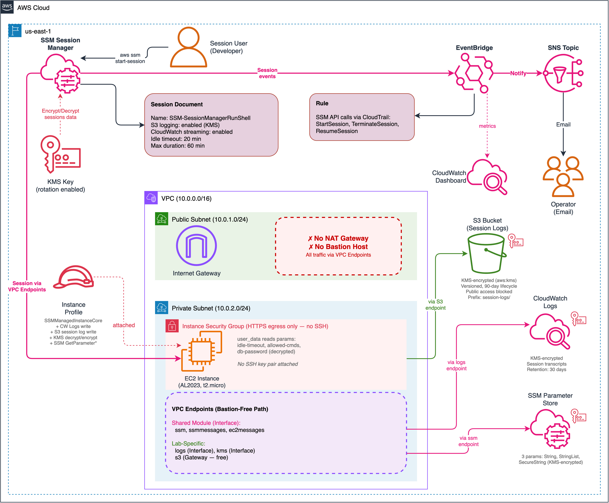
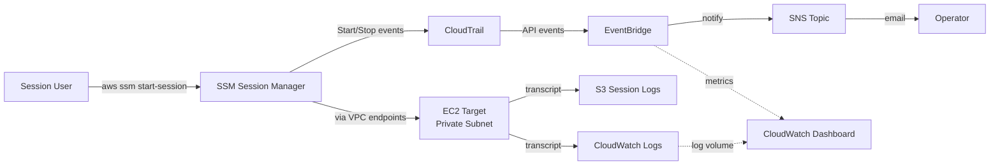

# Lab 03: Session Manager — Bastion Replacement

Replace traditional SSH bastion hosts with AWS Session Manager for secure, auditable instance access. Uses VPC endpoints (no NAT gateway) with session logging to CloudWatch and S3.

## Objective

- Configure Session Manager as a bastion-free access method for private EC2 instances
- Set up VPC endpoints for SSM (ssm, ssmmessages, ec2messages) to avoid NAT gateway
- Enable session logging to both CloudWatch Logs and S3
- Configure KMS encryption for session data
- Integrate Parameter Store for application configuration management
- Demonstrate IAM-based access control for sessions

## Architecture

<!-- TODO: Add architecture diagram after implementation -->



> To edit the diagram, open [`architecture.drawio`](./architecture.drawio) in [draw.io](https://app.diagrams.net/). Export as PNG to update `architecture.png`.

### Session Flow



## Session Manager Components

| Component | Purpose |
|---|---|
| VPC Endpoints (3x) | Private connectivity to SSM services without internet access |
| Session Document | Custom `SSM-SessionManagerRunShell` preferences (logging, encryption) |
| CloudWatch Log Group | Destination for session transcripts |
| S3 Bucket | Destination for session logs (long-term retention) |
| KMS Key | Encryption for session data in transit and at rest |
| Parameter Store | Application config stored as SecureString parameters |
| CloudWatch Dashboard | Operational metrics for session activity and log volume |

## Session Logging — CloudWatch vs S3

Both destinations receive the **same session transcript** (commands typed + output returned). The difference is delivery timing and storage purpose:

| | CloudWatch Logs | S3 Bucket |
| --- | --- | --- |
| **When** | Real-time streaming during session | Complete log uploaded after session ends |
| **Format** | Log stream (line-by-line) | Single log file |
| **Retention** | 30 days (configurable) | 90 days (configurable) |
| **Cost** | Higher per GB | Cheaper per GB |
| **Best for** | Live monitoring, alerting | Audit archives, compliance |

Both are configured via the Session Document. In production, many teams use both: CloudWatch for operational monitoring (e.g., alarm on suspicious commands) and S3 for durable long-term compliance archives (SOC 2, PCI-DSS).

## Important: SSM-SessionManagerRunShell

The session document **must** be named exactly `SSM-SessionManagerRunShell`. This is a **reserved document name** that the SSM Agent is hardcoded to read when starting any session — you cannot rename it. When you configure session preferences via the AWS Console, it creates/updates this same document behind the scenes.

**Account-level singleton:** Only one `SSM-SessionManagerRunShell` document can exist per AWS account per region. If it already exists (e.g., created via the Console or another deployment), `terraform apply` will fail. To adopt an existing document:

```bash
terraform import aws_ssm_document.session_preferences SSM-SessionManagerRunShell
```

**Without this document**, Session Manager still works but with AWS defaults: no S3 logging, no CloudWatch streaming, no KMS encryption, and no max session duration — making sessions effectively **unauditable**.

## KMS Key — What It Encrypts

A single customer-managed KMS key serves four encryption purposes in this lab:

1. **Session data stream (in transit)** — Set via `kmsKeyId` in the Session Document. Encrypts the bidirectional data stream between the operator's CLI and the EC2 instance during an active session. Every keystroke and output is encrypted end-to-end beyond the default TLS channel.

2. **Session logs at rest in S3** — The S3 bucket uses SSE-KMS with this key. The `s3EncryptionEnabled` setting in the Session Document tells the SSM agent to encrypt log data before sending it to S3.

3. **Session transcripts at rest in CloudWatch Logs** — The CloudWatch Log Group uses `kms_key_id` for at-rest encryption. The KMS key policy grants the `logs.{region}.amazonaws.com` service principal encrypt/decrypt permissions scoped to this specific log group.

4. **SecureString parameters** — The `db-password` parameter is encrypted at rest in Parameter Store using this key. The EC2 instance decrypts it at boot via `aws ssm get-parameter --with-decryption`, which calls KMS through the KMS VPC endpoint.

A single key simplifies IAM permissions (one `kms:Decrypt`/`kms:GenerateDataKey` grant covers everything). In production, consider separate keys for session encryption vs. parameter encryption to enforce least-privilege access boundaries.

## VPC Endpoints — The Bastion-Free Path

The EC2 instance sits in a private subnet with **no NAT gateway and no internet access**. All communication with AWS services flows through VPC endpoints — private connections that stay within the AWS network.

### Shared Module Endpoints (minimum for SSM)

Created by the `ssm-vpc` shared module when `enable_ssm_endpoints = true`:

| Endpoint | Type | Purpose |
| --- | --- | --- |
| `ssm` | Interface | SSM API calls (GetParameter, describe-instance-information, etc.) |
| `ssmmessages` | Interface | Session Manager's WebSocket-based data channel (the interactive session stream) |
| `ec2messages` | Interface | Polling channel for SSM Agent to receive commands from the SSM service |

Without these three, the instance would never appear in Fleet Manager and Session Manager wouldn't work.

### Lab-Specific Endpoints (session logging and encryption)

Created directly in this lab's `main.tf` because session logging and encryption need additional service access:

| Endpoint | Type | Purpose | Cost |
| --- | --- | --- | --- |
| `logs` | Interface | Send session transcripts to CloudWatch Logs | ~$7.20/mo |
| `kms` | Interface | Encrypt/decrypt session data and SecureString parameters | ~$7.20/mo |
| `s3` | Gateway | Write session logs to S3 bucket | Free |

### Interface vs Gateway Endpoints

- **Interface endpoints** create an ENI (network interface) in the private subnet with a private IP. They cost ~$7.20/month each.
- **Gateway endpoints** (available for S3 and DynamoDB only) add a route to the route table — no ENI, no cost.

The 2 additional interface endpoints add ~$14.40/month, which is why Lab 03 costs ~$45/month vs ~$22/month with only the 3 shared SSM endpoints.

## EventBridge Session Notifications

Session Manager does **not** emit its own native EventBridge event type. Instead, session activity is captured as **AWS API calls logged by CloudTrail**, which EventBridge can match using the `"AWS API Call via CloudTrail"` detail-type.

The EventBridge rule matches three SSM API calls:

| API Call | When it fires |
|---|---|
| `StartSession` | Operator runs `aws ssm start-session --target <instance-id>` |
| `TerminateSession` | Operator explicitly runs `aws ssm terminate-session --session-id <id>` |
| `ResumeSession` | Operator reconnects to a disconnected (but not terminated) session |

**Flow:** Operator starts/ends session → CloudTrail logs the API call → EventBridge matches the pattern → SNS publishes notification → Operator receives email.

**Important:** Typing `exit` in the session shell does **not** generate a `TerminateSession` CloudTrail event. When you type `exit`, the shell process ends and the SSM agent closes the WebSocket connection internally — no API call is made. `TerminateSession` only appears in CloudTrail when someone explicitly calls `aws ssm terminate-session`. As a result, you will reliably receive notifications for session **starts** but not for `exit`-based session ends.

**Prerequisite:** This lab creates a CloudTrail trail to log management events. Without an active trail, the EventBridge rule will exist but never fire — CloudTrail's "Event history" (visible in the Console) does **not** forward events to EventBridge.

## EC2 Boot Script — Parameter Resolution via VPC Endpoints

The `user_data.sh.tftpl` boot script runs at instance launch to prove that the bastion-free architecture works end-to-end. The EC2 instance is in a private subnet with **zero internet access**, yet it reads 3 SSM parameters through VPC endpoints:

| Parameter | Type | Value | Purpose |
| --- | --- | --- | --- |
| `config/idle-timeout` | String | `"20"` | Simulates a runtime config setting |
| `config/allowed-commands` | StringList | `"ls,cat,whoami,..."` | Simulates an app allowlist config |
| `secrets/db-password` | SecureString | KMS-encrypted | Demonstrates encrypted secret retrieval via KMS VPC endpoint |

The script calls `aws ssm get-parameter` for each (with `--with-decryption` for SecureString), writes them to `/opt/app/config.env` with `chmod 600`, and masks secrets in the log output.

These are **demo/sample data** — they don't drive actual application behavior. They exist to validate VPC endpoint connectivity. If any endpoint is missing, the `get-parameter` calls would timeout and the config file wouldn't be written.

## Key Concepts Demonstrated

- **Bastion-free architecture:** No public-facing jump hosts, no SSH keys to manage
- **VPC endpoints for SSM:** Three endpoints (ssm, ssmmessages, ec2messages) provide private API access
- **Session logging:** Full audit trail of interactive sessions to CloudWatch and S3
- **KMS encryption:** End-to-end encryption of session data
- **Parameter Store:** Centralized, encrypted configuration management
- **IAM-based access:** Fine-grained control over who can start sessions to which instances

## Deployment

### Prerequisites

- Terraform >= 1.5
- AWS CLI v2 configured with admin-level credentials
- Session Manager plugin for AWS CLI ([install guide](https://docs.aws.amazon.com/systems-manager/latest/userguide/session-manager-working-with-install-plugin.html))
- Region: `us-east-1`

### Steps

```bash
cd infrastructure/terraform

# Copy and edit variables
cp terraform.tfvars.example terraform.tfvars
# Edit terraform.tfvars as needed

# Deploy
terraform init
terraform plan
terraform apply
```

### Validation

After `terraform apply`, allow 1-2 minutes for the instance to register with SSM.

**1. Verify SSM connectivity:**

```bash
# Instance should appear in the list
aws ssm describe-instance-information --region us-east-1
```

**2. Start a session and verify parameter resolution:**

```bash
# Start a session (requires Session Manager plugin)
aws ssm start-session \
  --target <instance-id> \
  --region us-east-1

# Inside the session — verify the boot script resolved parameters via VPC endpoints
sudo cat /opt/app/config.env
# Expected output: idle-timeout, allowed-commands values, and db-password (masked in logs but visible in file)

# Exit the session
exit
```

**3. Verify session logging:**

```bash
# Check CloudWatch for session transcripts
aws logs describe-log-streams \
  --log-group-name /aws/ssm/session-logs/session-manager \
  --region us-east-1

# Check S3 for session logs
aws s3 ls s3://<bucket-name>/session-logs/ --region us-east-1
```

**4. Verify Parameter Store access (from your local machine):**

```bash
aws ssm get-parameter \
  --name "/session-manager/dev/secrets/db-password" \
  --with-decryption \
  --region us-east-1
```

**5. Verify session history and notifications:**

```bash
# View completed sessions
aws ssm describe-sessions --state History --region us-east-1
```

If you configured `notification_email`, check your inbox for the SNS subscription confirmation and subsequent session start/stop notification emails.

### Teardown

```bash
terraform destroy
```

## Cost Estimate

| Component | Estimated Monthly Cost |
|---|---|
| VPC Endpoints — SSM (3x interface) | ~$21.60/month |
| VPC Endpoint — CloudWatch Logs (interface) | ~$7.20/month |
| VPC Endpoint — KMS (interface) | ~$7.20/month |
| VPC Endpoint — S3 (gateway) | Free |
| EC2 t2.micro (test instance) | ~$7.50/month |
| KMS key | ~$1/month |
| CloudWatch Logs (session logs) | ~$0.50/month |
| S3 storage (session logs) | ~$0.10/month |
| Session Manager | Free |
| Parameter Store (standard) | Free |
| **Total** | **~$45/month** |

Always run `terraform destroy` when done to stop VPC endpoint and EC2 charges.

## Enhancement Layers

- [x] Layer 1: Infrastructure as Code (Terraform) — this lab
- [x] Layer 2: CI/CD Pipeline (GitHub Actions for terraform fmt/validate)
- [x] Layer 3: Monitoring (CloudWatch dashboard for session activity and access patterns)
- [ ] Layer 4: Finance Domain Twist (PCI-DSS compliant access logging and audit controls)
- [ ] Layer 5: Multi-Cloud Extension (Azure Bastion equivalent)
