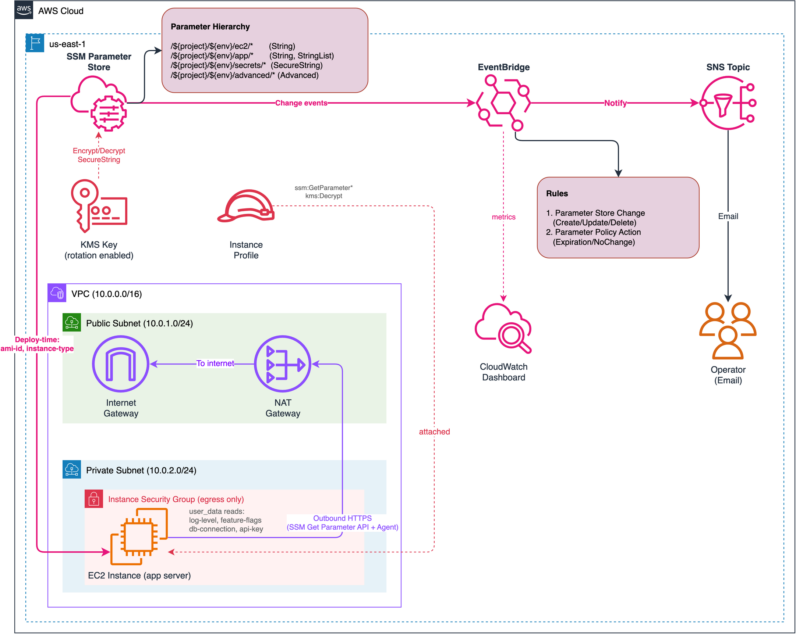
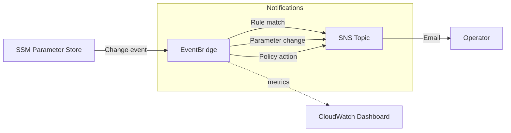
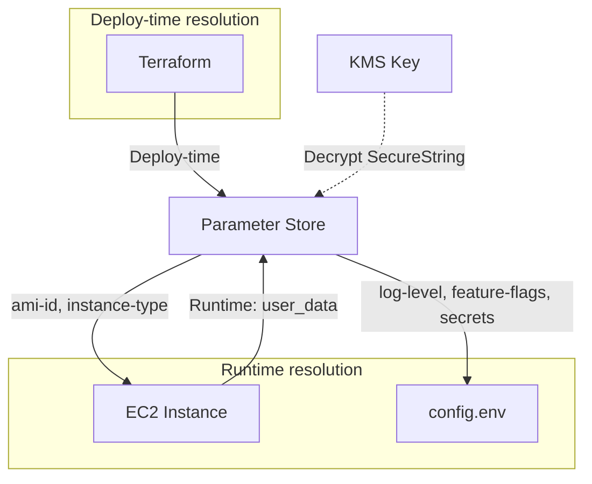

# Lab 04: Parameter Store — Event-Driven Configuration

Manage application configuration through SSM Parameter Store with a hierarchical parameter design, KMS encryption for secrets, and EventBridge-driven notifications for change detection.

## Objective

- Build a hierarchical parameter structure using path-based naming (`/${project}/${env}/category/name`)
- Demonstrate all three parameter types: String, StringList, SecureString
- Encrypt secrets with a customer-managed KMS key (key rotation enabled)
- Show deploy-time vs runtime parameter resolution on an EC2 instance
- Use Advanced tier with parameter policies (Expiration, ExpirationNotification, NoChangeNotification)
- Detect parameter changes via EventBridge and route notifications to SNS

## Architecture



> To edit the diagram, open [`architecture.drawio`](./architecture.drawio) in [draw.io](https://app.diagrams.net/). Export as PNG to update `architecture.png`.

### Event Flow



### Parameter Resolution Flow



## Parameter Hierarchy

```
/${project_name}/${environment}/
  ec2/
    instance-type         (String, Standard)       "t2.micro"
    ami-id                (String, Standard)       resolved AMI ID (data_type: aws:ec2:image)
  app/
    environment           (String, Standard)       "dev"
    log-level             (String, Standard)       "INFO"
    feature-flags         (StringList, Standard)   "enable-monitoring,enable-alerts"
  secrets/
    db-connection-string  (SecureString, Standard)  KMS-encrypted connection string
    api-key               (SecureString, Standard)  KMS-encrypted API key
  advanced/
    cert-thumbprint       (String, Advanced)        with Expiration + ExpirationNotification + NoChangeNotification policies
```

## Resources Created

| Resource | Purpose |
|---|---|
| VPC + public/private subnets | Network isolation for application server |
| Internet Gateway | Public subnet internet access |
| NAT Gateway + EIP | Private subnet outbound (SSM Agent connectivity) |
| Instance Security Group | Egress-only SG for EC2 |
| IAM Role (EC2 trust) | Instance profile for SSM Agent + Parameter Store read + KMS decrypt |
| IAM Instance Profile | Attached to EC2 for SSM connectivity |
| IAM Policy | `ssm:GetParameter*`, `ssm:GetParametersByPath`, `kms:Decrypt` |
| KMS Key + Alias | Customer-managed key for SecureString encryption (rotation enabled) |
| SSM Parameters (8 total) | 4 String + 1 StringList + 2 SecureString + 1 Advanced |
| EC2 Instance (t2.micro) | Application server reading params at boot via user_data |
| SNS Topic + Policy | Notification channel for parameter change events |
| SNS Subscription | Email subscription (conditional on `notification_email`) |
| EventBridge Rule (change) | Matches Parameter Store Create/Update/Delete/LabelParameterVersion |
| EventBridge Rule (policy) | Matches Parameter Store Policy Action (expiration/no-change warnings) |
| EventBridge Targets (2) | Routes both event types to SNS |
| null_resource | Applies parameter policies via CLI (workaround for Terraform limitation) |
| CloudWatch Dashboard | Operational metrics for parameter change events and policy actions |

## Deployment

### Prerequisites

- Terraform >= 1.5
- AWS CLI v2 configured with admin-level credentials
- Region: `us-east-1`

### Steps

```bash
cd infrastructure/terraform

# Copy and edit variables
cp terraform.tfvars.example terraform.tfvars
# Edit terraform.tfvars — set notification_email to receive alerts

# Deploy
terraform init
terraform plan
terraform apply
```

### Validation

```bash
# 1. Verify all 8 parameters exist
PARAM_PREFIX=$(terraform output -raw parameter_prefix)
aws ssm get-parameters-by-path \
  --path "$PARAM_PREFIX" --recursive \
  --query "Parameters[].{Name:Name,Type:Type}" \
  --output table --region us-east-1

# 2. Verify SecureString decryption with customer-managed KMS
aws ssm get-parameter \
  --name "$PARAM_PREFIX/secrets/db-connection-string" \
  --with-decryption \
  --query "Parameter.Value" --output text --region us-east-1

# 3. Verify Advanced tier and parameter policies
aws ssm describe-parameters \
  --parameter-filters "Key=Name,Values=$PARAM_PREFIX/advanced/cert-thumbprint" \
  --query "Parameters[0].{Tier:Tier,Policies:Policies}" \
  --region us-east-1

# 4. Trigger a parameter change event (updates log-level -> check email)
aws ssm put-parameter \
  --name "$PARAM_PREFIX/app/log-level" \
  --value "DEBUG" --overwrite \
  --region us-east-1

# 5. Verify EC2 runtime config via Run Command
INSTANCE_ID=$(terraform output -raw app_server_id)
COMMAND_ID=$(aws ssm send-command \
  --instance-ids "$INSTANCE_ID" \
  --document-name "AWS-RunShellScript" \
  --parameters 'commands=["cat /opt/app/config.env"]' \
  --query "Command.CommandId" --output text --region us-east-1)

# Wait a few seconds, then retrieve output
aws ssm get-command-invocation \
  --command-id "$COMMAND_ID" \
  --instance-id "$INSTANCE_ID" \
  --query "{Status:Status,Output:StandardOutputContent}" \
  --region us-east-1
```

### Teardown

```bash
terraform destroy
```

All resources are Terraform-managed. No out-of-band cleanup needed.

## Cost Estimate

| Component | Estimated Monthly Cost |
|---|---|
| NAT Gateway (SSM Agent connectivity) | ~$32.00 |
| EC2 t2.micro (1 instance) | ~$7.50 |
| KMS key (customer-managed) | ~$1.00 |
| SSM Parameter Store (7 Standard + 1 Advanced) | ~$0.05 |
| EventBridge (2 rules) | Free |
| SNS (email) | Free |
| **Total** | **~$40.55/month** |

Always run `terraform destroy` when done to stop NAT gateway and EC2 charges.

## Key Concepts Demonstrated

- **Parameter hierarchy:** Path-based organization (`/${project}/${env}/category/name`) enables per-environment isolation and `GetParametersByPath` recursive queries
- **All three parameter types:** String (plain config), StringList (comma-separated feature flags), SecureString (KMS-encrypted secrets)
- **Customer-managed KMS:** Explicit key with rotation enabled, scoped IAM permissions for `kms:Decrypt`
- **Deploy-time vs runtime resolution:** AMI ID and instance type resolved at `terraform plan`; log-level, feature-flags, and secrets read at EC2 boot via user_data script
- **Advanced tier + parameter policies:** Expiration date, ExpirationNotification (15 days before), NoChangeNotification (7 days of no updates) — applied via CLI workaround
- **Event-driven detection:** EventBridge rules match both parameter changes (CRUD operations) and policy actions (expiration/no-change warnings), routed to SNS for operator notification
- **aws:ec2:image data_type:** Parameter Store validates that the AMI ID value is a valid EC2 image identifier

## Enhancement Layers

- [x] Layer 1: Infrastructure as Code (Terraform) — this lab
- [x] Layer 2: CI/CD Pipeline (GitHub Actions for terraform fmt/validate)
- [x] Layer 3: Monitoring (CloudWatch dashboard for parameter access metrics, KMS usage)
- [ ] Layer 4: Finance Domain Twist (SOX-compliant secrets rotation, PCI-DSS parameter audit trail)
- [ ] Layer 5: Multi-Cloud Extension (Azure Key Vault + App Configuration side-by-side)
