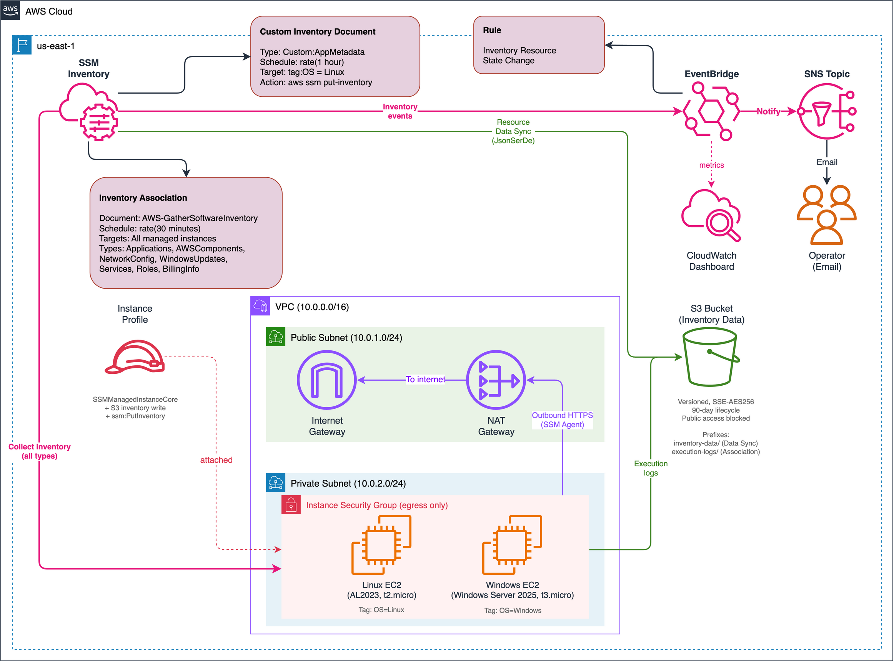
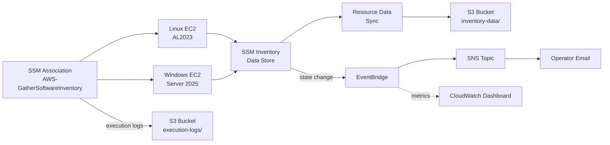
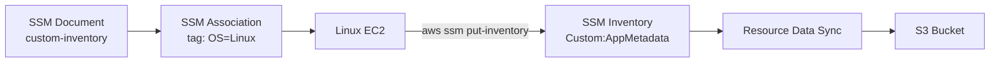

# Lab 05: Inventory — Resource Data Sync

Collect software inventory from a heterogeneous Linux/Windows fleet using SSM Inventory, centralize data in S3 via Resource Data Sync, register custom inventory types, and detect inventory changes with EventBridge notifications.

## Objective

- Deploy a heterogeneous fleet with Amazon Linux 2023 and Windows Server 2025 instances
- Configure SSM Inventory association to collect built-in inventory types (applications, AWS components, network config, Windows updates, services, roles)
- Set up Resource Data Sync to export inventory data to S3 in JsonSerDe format for querying
- Create a custom SSM document that registers `Custom:AppMetadata` inventory via `aws ssm put-inventory`
- Schedule custom inventory collection on Linux instances using tag-based targeting
- Store inventory execution logs in a versioned, encrypted S3 bucket with lifecycle policies
- Detect inventory resource state changes via EventBridge and notify operators via SNS
- Demonstrate cross-platform inventory visibility across Linux and Windows

## Architecture



> To edit the diagram, open [`architecture.drawio`](./architecture.drawio) in [draw.io](https://app.diagrams.net/). Export as PNG to update `architecture.png`.

### Inventory Collection Flow



### Custom Inventory Flow



## Inventory Data Types Collected

| Inventory Type | Linux | Windows | Description |
|---|:---:|:---:|---|
| AWS:Application | Y | Y | Installed applications and packages |
| AWS:AWSComponent | Y | Y | AWS components (e.g., amazon-ssm-agent) |
| AWS:NetworkConfig | Y | Y | Network interfaces, IPs, DNS settings |
| AWS:WindowsUpdate | - | Y | Windows Update history and status |
| AWS:InstanceDetailedInformation | Y | Y | CPU, memory, OS details |
| AWS:Service | - | Y | Windows services and their states |
| AWS:WindowsRole | - | Y | Installed Windows Server roles |
| AWS:BillingInfo | - | Y | License and billing metadata |
| Custom:AppMetadata | Y | - | Custom application metadata (via SSM document) |

## Resources Created

| Resource | Type | Purpose |
|---|---|---|
| `module.ssm_vpc` | VPC + subnets + NAT | Network infrastructure with private subnet internet access |
| `aws_s3_bucket.inventory` | S3 Bucket | Inventory data and execution log storage |
| `aws_s3_bucket_versioning.inventory` | S3 Versioning | Enable versioning on inventory bucket |
| `aws_s3_bucket_lifecycle_configuration.inventory` | S3 Lifecycle | Auto-expire data after 90 days |
| `aws_s3_bucket_server_side_encryption_configuration.inventory` | S3 Encryption | AES-256 server-side encryption |
| `aws_s3_bucket_public_access_block.inventory` | S3 Public Access | Block all public access |
| `aws_s3_bucket_policy.ssm_inventory` | S3 Bucket Policy | Allow SSM service to write inventory data |
| `aws_iam_policy.inventory_s3_write` | IAM Policy | S3 write permission for instance role |
| `aws_iam_policy.inventory_put` | IAM Policy | `ssm:PutInventory` permission for custom inventory |
| `module.ssm_instance_profile` | IAM Role + Profile | SSMCore + S3 write + PutInventory |
| `aws_instance.linux_target` | EC2 Instance (t2.micro) | Amazon Linux 2023 inventory target |
| `aws_instance.windows_target` | EC2 Instance (t3.micro) | Windows Server 2025 inventory target |
| `aws_ssm_association.inventory_collection` | SSM Association | AWS-GatherSoftwareInventory with all types enabled |
| `aws_ssm_resource_data_sync.inventory_to_s3` | Resource Data Sync | Export inventory to S3 in JsonSerDe format |
| `aws_ssm_document.custom_inventory` | SSM Document (Command) | Collects and registers Custom:AppMetadata |
| `aws_ssm_association.custom_inventory` | SSM Association | Schedules custom inventory on Linux instances |
| `aws_sns_topic.inventory_notifications` | SNS Topic | Inventory change notification channel |
| `aws_sns_topic_policy.eventbridge_publish` | SNS Policy | Allow EventBridge to publish |
| `aws_sns_topic_subscription.email` | SNS Subscription | Optional email subscription |
| `aws_cloudwatch_event_rule.inventory_change` | EventBridge Rule | Inventory Resource State Change detection |
| `aws_cloudwatch_event_target.inventory_change_sns` | EventBridge Target | Route inventory events to SNS |
| CloudWatch Dashboard | Operational metrics for inventory collection and state changes |

## Deployment

### Prerequisites

- Terraform >= 1.5
- AWS CLI v2 configured with admin-level credentials
- Region: `us-east-1`

### Steps

```bash
cd infrastructure/terraform

# Copy and edit variables
cp terraform.tfvars.example terraform.tfvars
# Edit terraform.tfvars — set notification_email to receive alerts

# Deploy
terraform init
terraform plan
terraform apply
```

### Validation

After deployment, wait 5-10 minutes for the Windows instance to register with SSM (Linux typically registers within 1-2 minutes):

```bash
# 1. Verify both instances registered with SSM
aws ssm describe-instance-information \
  --query "InstanceInformationList[*].[InstanceId,PingStatus,PlatformName,PlatformType]" \
  --output table --region us-east-1

# 2. Check inventory association status
aws ssm describe-association \
  --association-id "$(terraform output -raw inventory_association_id)" \
  --query "AssociationDescription.{Name:Name,Status:Overview.Status}" \
  --region us-east-1

# 3. List inventory entries for Linux instance (applications)
LINUX_ID=$(terraform output -raw linux_instance_id)
aws ssm list-inventory-entries \
  --instance-id "$LINUX_ID" \
  --type-name "AWS:Application" \
  --max-results 5 --region us-east-1

# 4. List inventory entries for Windows instance (Windows updates)
WINDOWS_ID=$(terraform output -raw windows_instance_id)
aws ssm list-inventory-entries \
  --instance-id "$WINDOWS_ID" \
  --type-name "AWS:WindowsUpdate" \
  --max-results 5 --region us-east-1

# 5. Verify Resource Data Sync
aws ssm list-resource-data-sync \
  --query "ResourceDataSyncItems[*].[SyncName,S3Destination.BucketName,SyncType]" \
  --output table --region us-east-1

# 6. Check S3 for synced inventory data
BUCKET=$(terraform output -raw inventory_bucket_name)
aws s3 ls "s3://$BUCKET/inventory-data/" --recursive | head -20

# 7. Check custom inventory on Linux instance
# If this returns InvalidTypeNameException, the association hasn't run yet.
# Force it with: aws ssm start-associations-once \
#   --association-ids "$(terraform output -raw custom_inventory_association_id)" \
#   --region us-east-1
# Wait ~30 seconds, then retry.
aws ssm list-inventory-entries \
  --instance-id "$LINUX_ID" \
  --type-name "Custom:AppMetadata" \
  --region us-east-1
```

### Teardown

```bash
terraform destroy
```

All resources are Terraform-managed. No out-of-band cleanup needed.

## Cost Estimate

| Component | Estimated Monthly Cost |
|---|---|
| NAT Gateway (SSM Agent connectivity) | ~$32.00 |
| EC2 t2.micro (Linux, 1 instance) | ~$7.50 |
| EC2 t3.micro (Windows, 1 instance) | ~$12.00 |
| SSM Inventory + Resource Data Sync | Free |
| S3 storage (inventory data + logs) | ~$0.10 |
| EventBridge rule | Free |
| SNS (email) | Free |
| **Total** | **~$51.60/month** |

Always run `terraform destroy` when done to stop NAT gateway and EC2 charges.

## Key Concepts Demonstrated

- **Heterogeneous fleet inventory:** Cross-platform data collection from both Linux and Windows instances using a single SSM Inventory association
- **Built-in inventory types:** Applications, AWS components, network config, Windows updates, instance details, services, roles, and billing info — each providing different visibility into the fleet
- **Resource Data Sync:** Centralized export of inventory data to S3 in JsonSerDe format, enabling Athena queries and long-term retention beyond the 30-day SSM rolling window
- **Custom inventory types:** `Custom:AppMetadata` registered via `aws ssm put-inventory` demonstrates extending SSM Inventory beyond built-in types for application-specific metadata
- **SSM Document as collection agent:** Command document with `aws:runShellScript` action collects runtime metadata (hostname, kernel, uptime) and registers it as custom inventory
- **Tag-based targeting:** Custom inventory association targets only Linux instances using `tag:OS = Linux`, demonstrating selective fleet operations
- **Event-driven inventory detection:** EventBridge captures `Inventory Resource State Change` events and routes to SNS for real-time awareness of fleet changes
- **S3 best practices:** Versioning, AES-256 encryption, public access block, lifecycle policies, and SSM service bucket policy with ACL condition
- **Security-conscious networking:** Private subnet with NAT gateway — no public IPs on managed instances

## Enhancement Layers

- [x] Layer 1: Infrastructure as Code (Terraform) — this lab
- [x] Layer 2: CI/CD Pipeline (GitHub Actions for terraform fmt/validate)
- [x] Layer 3: Monitoring (CloudWatch dashboard for inventory collection metrics, Athena queries)
- [ ] Layer 4: Finance Domain Twist (SOX inventory audit trail, PCI-DSS asset tracking)
- [ ] Layer 5: Multi-Cloud Extension (Azure Automation Inventory side-by-side)

## References

- [AWS Systems Manager Inventory](https://docs.aws.amazon.com/systems-manager/latest/userguide/systems-manager-inventory.html)
- [Setting up Inventory](https://docs.aws.amazon.com/systems-manager/latest/userguide/sysman-inventory-configuring.html)
- [AWS-GatherSoftwareInventory](https://docs.aws.amazon.com/systems-manager/latest/userguide/sysman-inventory-collect.html)
- [Resource Data Sync](https://docs.aws.amazon.com/systems-manager/latest/userguide/sysman-inventory-datasync.html)
- [Custom Inventory](https://docs.aws.amazon.com/systems-manager/latest/userguide/sysman-inventory-custom.html)
- [Inventory Metadata Types](https://docs.aws.amazon.com/systems-manager/latest/userguide/sysman-inventory-schema.html)
- [EventBridge SSM Events](https://docs.aws.amazon.com/systems-manager/latest/userguide/monitoring-eventbridge-events.html)
- [AWS Systems Manager Pricing](https://aws.amazon.com/systems-manager/pricing/)
