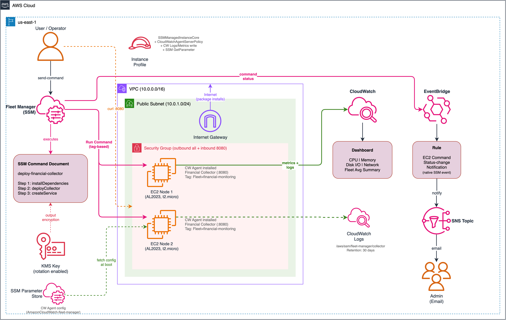

# Lab 06: Fleet Manager — Node Management

Manage a fleet of EC2 instances using AWS Fleet Manager with Run Command for application deployment, CloudWatch Agent for enhanced performance monitoring, and centralized dashboards for fleet-wide observability.

## Objective

- Deploy a fleet of EC2 nodes in a public subnet with SSM Agent connectivity via internet gateway
- Create a custom SSM Command document to deploy a financial metrics collector application
- Install and configure CloudWatch Agent for system metrics (CPU, memory, disk, network) via SSM Parameter Store
- Build a CloudWatch dashboard for fleet-wide performance monitoring
- Set up EventBridge rules for native Run Command status change notifications
- Provide a KMS key for Run Command output encryption

## Architecture



> To edit the diagram, open [`architecture.drawio`](./architecture.drawio) in [draw.io](https://app.diagrams.net/). Export as PNG to update `architecture.png`.

## Fleet Manager Components

| Component | Purpose |
|---|---|
| EC2 Fleet (2x t2.micro) | Managed nodes in public subnet with `Fleet=financial-monitoring` tag |
| Custom SSM Command Document | 3-step deployment: install dependencies, deploy collector, create systemd service |
| CloudWatch Agent | System metrics (CPU, memory, disk, network) + application log collection |
| SSM Parameter Store | CloudWatch Agent configuration stored centrally |
| CloudWatch Dashboard | Fleet-wide performance visualization (6 widget panels) |
| KMS Key | Customer-managed key for Run Command output encryption |
| EventBridge + SNS | Native Run Command status change notifications (no CloudTrail needed) |

## Fleet Manager vs Lab 03 (Session Manager)

This lab and Lab 03 both use SSM, but they serve different operational purposes:

| Aspect | Lab 03 — Session Manager | Lab 06 — Fleet Manager |
|---|---|---|
| **Primary purpose** | Secure interactive shell access | Fleet-wide operational management |
| **Network** | Private subnet + VPC endpoints (no internet) | Public subnet + IGW (internet access) |
| **SSM feature** | Session Manager (interactive sessions) | Run Command (batch execution) |
| **Monitoring** | Session logging (CloudWatch + S3) | System metrics (CloudWatch Agent + dashboard) |
| **Events** | Session lifecycle via CloudTrail | Run Command status via native SSM events |
| **Cost** | ~$45/month (VPC endpoints) | ~$25/month (no endpoints needed) |

## Custom SSM Command Document

The `deploy-financial-collector` document executes three steps on targeted fleet nodes:

1. **installDependencies** — Installs Python3 and pip via `dnf` (AL2023)
2. **deployCollector** — Writes a Python HTTP server to `/opt/financial-collector/app.py` that serves:
   - `GET /metrics` — Simulated financial data (stock prices, portfolio value, trade volume)
   - `GET /health` — Health check with uptime and version
3. **createService** — Creates a systemd service, enables it, and starts it

The document can be executed via Fleet Manager console or CLI:

```bash
aws ssm send-command \
  --document-name "fleet-manager-deploy-financial-collector" \
  --targets Key=tag:Fleet,Values=financial-monitoring \
  --region us-east-1
```

## CloudWatch Agent — Configuration via SSM Parameter Store

The CloudWatch Agent configuration is stored as an SSM parameter (`AmazonCloudWatch-fleet-manager`) and fetched at boot time. This pattern allows centralized config management — update the parameter and restart the agent across the fleet.

### Metrics Collected

| Category | Metrics | Interval |
|---|---|---|
| CPU | `cpu_usage_idle`, `cpu_usage_user`, `cpu_usage_system` (total) | 60s |
| Memory | `mem_used_percent`, `mem_available` | 60s |
| Disk | `disk_used_percent` (path `/`) | 60s |
| Disk I/O | `diskio_reads`, `diskio_writes` | 60s |
| Network | `net_bytes_sent`, `net_bytes_recv` | 60s |

All metrics are published to the `fleet-manager/Fleet` namespace with `InstanceId` as a dimension.

### Application Logs

The collector's log file (`/var/log/financial-collector/app.log`) is shipped to CloudWatch Logs at `/aws/ssm/fleet-manager/collector` with stream name `{instance_id}/collector`.

## CloudWatch Dashboard

The `fleet-manager-fleet-performance` dashboard provides six widget panels:

| Row | Left Widget | Right Widget |
|---|---|---|
| 1 | CPU Utilization per Instance (line chart) | Memory Usage per Instance (line chart) |
| 2 | Disk I/O per Instance (stacked area) | Network Traffic (bytes sent/recv) |
| 3 | Fleet Average CPU (single value) | Fleet Average Memory (single value) |

## EventBridge — Native Run Command Events

Run Command emits native `EC2 Command Status-change Notification` events directly to EventBridge — **no CloudTrail trail required**. This is different from Session Manager events (Lab 03), which require CloudTrail.

The EventBridge rule matches all Run Command status changes and routes them to an SNS topic for email notifications.

## Key Concepts Demonstrated

- **Fleet Manager operations:** Centralized node management via Run Command
- **Tag-based targeting:** Deploy to instances by `Fleet=financial-monitoring` tag
- **CloudWatch Agent:** Enhanced OS-level metrics beyond default EC2 monitoring
- **SSM Parameter Store for config:** Centralized agent configuration management
- **CloudWatch Dashboards:** Fleet-wide performance visualization
- **Native SSM events:** Run Command status notifications without CloudTrail dependency

## Deployment

### Prerequisites

- Terraform >= 1.5
- AWS CLI v2 configured with admin-level credentials
- Region: `us-east-1`

### Steps

```bash
cd infrastructure/terraform

# Copy and edit variables
cp terraform.tfvars.example terraform.tfvars
# Edit terraform.tfvars as needed

# Deploy
terraform init
terraform plan
terraform apply
```

### Validation

After `terraform apply`, allow 1-2 minutes for instances to boot and register with SSM.

**1. Verify managed nodes:**

```bash
aws ssm describe-instance-information --region us-east-1
```

Both fleet nodes should appear with `PingStatus = Online`.

**2. Run the deploy document:**

```bash
aws ssm send-command \
  --document-name "fleet-manager-deploy-financial-collector" \
  --targets Key=tag:Fleet,Values=financial-monitoring \
  --region us-east-1
```

**3. Check command status:**

```bash
# Use the command-id from the send-command output
aws ssm list-command-invocations \
  --command-id <command-id> \
  --details \
  --region us-east-1
```

**4. Verify the financial collector (wait ~30s after command completes):**

```bash
# Replace with actual public IPs from terraform output
curl http://<public-ip-1>:8080/metrics
curl http://<public-ip-2>:8080/health
```

**5. Check CloudWatch Dashboard:**

Open the AWS Console > CloudWatch > Dashboards > `fleet-manager-fleet-performance`. Metrics should start appearing within 5 minutes of instance boot.

**6. Check SNS notifications:**

If you configured `notification_email`, check your inbox for the SNS subscription confirmation. Subsequent Run Command executions will trigger email notifications.

**7. Optional — Session Manager access:**

```bash
aws ssm start-session --target <instance-id> --region us-east-1
```

Works with AWS defaults even without Lab 03's session document.

### Teardown

```bash
terraform destroy
```

## Cost Estimate

| Component | Estimated Monthly Cost |
|---|---|
| EC2 t2.micro (2x) | ~$15/month |
| KMS key | ~$1/month |
| CloudWatch custom metrics (~20) | ~$6/month |
| CloudWatch Logs (collector logs) | ~$0.50/month |
| CloudWatch Dashboard (1) | $3/month |
| SSM Run Command | Free |
| SSM Parameter Store (standard) | Free |
| SNS notifications | ~$0.01/month |
| **Total** | **~$25/month** |

Cheapest lab in the collection — no NAT gateway, no VPC endpoints.

Always run `terraform destroy` when done to stop EC2 and CloudWatch charges.

## Enhancement Layers

- [x] Layer 1: Infrastructure as Code (Terraform) — this lab
- [x] Layer 2: CI/CD Pipeline (GitHub Actions for terraform fmt/validate)
- [x] Layer 3: Monitoring (CloudWatch Alarms for fleet health thresholds)
- [ ] Layer 4: Finance Domain Twist (SOX-compliant deployment auditing)
- [ ] Layer 5: Multi-Cloud Extension (Azure Update Management equivalent)
