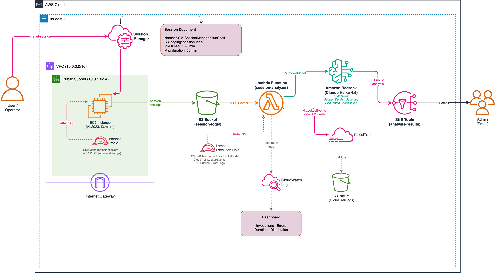
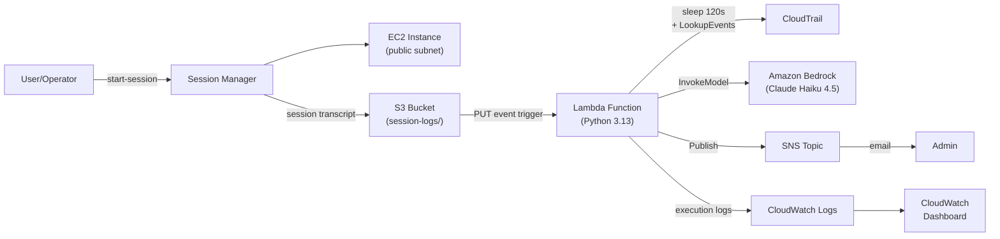

# Lab 07: Bedrock Session Log Analysis

## Objective

Deploy an AI-powered pipeline that automatically analyzes SSM Session Manager logs using Amazon Bedrock, enriches findings with CloudTrail metadata, and delivers security-focused reports via SNS.

- Configure Session Manager to store session transcripts in S3
- Create a Lambda function triggered by S3 PUT events to analyze session logs
- Invoke Amazon Bedrock (Claude Haiku 4.5) for security-focused log analysis
- Enrich analysis with CloudTrail session metadata (IAM user, instance, source IP, timestamp)
- Deliver analysis reports via SNS email notifications
- Build a CloudWatch dashboard for pipeline observability

This lab is the **AI capstone** for the SSM operations story: provision (Lab 01) &rarr; patch (Lab 02) &rarr; access (Lab 03) &rarr; configure (Lab 04) &rarr; audit (Lab 05) &rarr; manage (Lab 06) &rarr; **analyze with AI** (Lab 07).

## Architecture Overview



*Source: [architecture.drawio](architecture.drawio)*



### Pipeline Components

| Component | Resource | Purpose |
|---|---|---|
| EC2 Instance | `aws_instance.session_target` | Generate session logs via Session Manager |
| S3 Bucket | `aws_s3_bucket.session_logs` | Store session transcripts (trigger source) |
| SSM Session Document | `aws_ssm_document.session_preferences` | Configure Session Manager logging to S3 |
| Lambda Function | `aws_lambda_function.session_analyzer` | Orchestrate analysis pipeline |
| Amazon Bedrock | Claude Haiku 4.5 (inference profile) | AI-powered session log analysis |
| CloudTrail | `aws_cloudtrail.management_events` | Session metadata enrichment (who, when, where) |
| SNS Topic | `aws_sns_topic.analysis_results` | Deliver analysis reports via email |
| CloudWatch Dashboard | `aws_cloudwatch_dashboard.analysis_pipeline` | Pipeline invocation and latency metrics |

## How It Works

1. **Session activity** &mdash; An operator starts a Session Manager session to the EC2 instance, runs commands, then terminates the session.

2. **Log delivery** &mdash; Session Manager automatically uploads the session transcript to the S3 bucket under the `session-logs/` prefix.

3. **Lambda trigger** &mdash; The S3 PUT event fires the Lambda function.

4. **CloudTrail enrichment** &mdash; Lambda waits 120 seconds for CloudTrail event propagation, then queries `LookupEvents` for the matching `StartSession` event to extract the IAM user, EC2 instance ID, AWS account, source IP, and session start time.

5. **Bedrock analysis** &mdash; Lambda reads the session log from S3, constructs a security-focused prompt with the CloudTrail metadata, and invokes Bedrock (Claude Haiku 4.5) for analysis.

6. **Report delivery** &mdash; The AI-generated analysis (session details, summary, risk rating, justification) is published to the SNS topic, delivering an email to the subscribed admin.

### Lambda Function &mdash; Analysis Prompt

The Lambda function sends a structured prompt to Bedrock requesting:

- **SESSION DETAILS** &mdash; Who initiated the session, which instance, account/IP, timestamp
- **SUMMARY** &mdash; 1-3 bullet points of key actions performed
- **RISK RATING** &mdash; No-Risk, Low-Risk, Medium-Risk, or High-Risk
- **JUSTIFICATION** &mdash; Bullet points explaining the rating

### CloudTrail Integration

Session Manager does not include user identity in its S3 log files. The Lambda function bridges this gap by:

1. Extracting the session ID from the S3 object key
2. Querying CloudTrail for recent `StartSession` events (last 10 minutes)
3. Matching the session ID to correlate the log with the IAM principal
4. Passing the enriched metadata to Bedrock for context-aware analysis

The 120-second wait accounts for CloudTrail's eventual consistency &mdash; events typically appear within 5-15 minutes of the API call, but the S3 log upload also has a delay after session termination.

## Key Concepts

- **Amazon Bedrock** &mdash; Fully managed service for foundation models. Serverless models are automatically enabled across all AWS commercial regions &mdash; no manual model access enablement is required.
- **Foundation model vs. cross-region inference profile** &mdash; Bedrock offers two ways to invoke a model:
  - **Foundation model ID** (`anthropic.claude-haiku-4-5-20251001-v1:0`) &mdash; Invokes the model in a single region (e.g. `us-east-1`). If that region is at capacity or unavailable, the request fails. The ARN uses an empty account field because the model is AWS-owned: `arn:aws:bedrock:*::foundation-model/anthropic.claude-haiku-4-5-20251001-v1:0`.
  - **Cross-region inference profile** (`us.anthropic.claude-haiku-4-5-20251001-v1:0`) &mdash; The `us.` prefix tells Bedrock to route to the optimal US region automatically, providing higher availability and throughput. The ARN includes your account: `arn:aws:bedrock:*:*:inference-profile/us.anthropic.claude-haiku-4-5-20251001-v1:0`. Other prefixes exist for geographic scoping (`eu.` for EU, `au.` for Australia).

  This lab uses the `us.` inference profile for availability while staying within US regions for data residency. The Lambda IAM policy must allow **both** ARNs &mdash; the inference profile (routing entry point) and the underlying foundation model (what runs the inference) &mdash; otherwise `InvokeModel` calls fail with access denied.
- **S3 event notifications** &mdash; Serverless trigger pattern where S3 PUT events invoke Lambda directly (no EventBridge intermediary needed).
- **CloudTrail LookupEvents** &mdash; API for querying recent management events without setting up Athena queries or log processing.
- **SSM-SessionManagerRunShell** &mdash; Account-level singleton document that configures Session Manager preferences (logging, encryption, timeouts) for all sessions in the region.

## Deployment

### Prerequisites

1. **AWS CLI v2** configured with appropriate credentials
2. **Terraform >= 1.5** installed
3. **Bedrock model access** &mdash; Serverless models are auto-enabled across all commercial regions. Note that for Anthropic models, first-time users may need to submit use case details before they can access the model.
4. If **Lab 03** is deployed in the same account/region, set `create_session_document = false` in your `terraform.tfvars` to avoid the SSM-SessionManagerRunShell singleton conflict

### Steps

```bash
cd labs/07-bedrock-session-log-analysis/infrastructure/terraform

# Configure variables
cp terraform.tfvars.example terraform.tfvars
# Edit terraform.tfvars — set notification_email to receive analysis reports

terraform init
terraform plan
terraform apply
```

### Validation

1. Confirm the SNS email subscription (check your inbox for the confirmation link)

2. Start a Session Manager session:
   ```bash
   # Use the output from terraform apply
   aws ssm start-session --target <instance-id> --region us-east-1
   ```

3. Run test commands and terminate the session:
   ```bash
   whoami
   uptime
   echo "Session Manager test"
   exit
   ```

4. Wait 3-4 minutes for the pipeline to process (120s CloudTrail wait + Bedrock analysis)

5. Check your email for the AI-generated security analysis

6. For a suspicious-activity test, start a new session and run:
   ```bash
   whoami
   id
   uname -a
   echo "API_KEY=TEST_SECRET" > /tmp/dummy_credentials.txt
   cat /tmp/dummy_credentials.txt
   curl -I https://example.com
   exit
   ```

7. Check the CloudWatch dashboard for Lambda metrics:
   ```bash
   # Use the dashboard_url output from terraform apply
   ```

### Teardown

```bash
terraform destroy
```

> **Important:** Always destroy resources after testing to avoid ongoing charges.

## Cost Estimate

| Component | Estimated Monthly Cost |
|---|---|
| EC2 t3.micro | ~$7.50/month |
| S3 storage (session + CloudTrail logs) | ~$0.20/month |
| Lambda invocations | ~$0.01/month |
| Bedrock (per invocation) | ~$0.01-0.10 |
| CloudWatch Dashboard | $3.00/month |
| CloudTrail (management events) | Free |
| SNS notifications | Free tier |
| **Total** | **~$11/month** |

> **Note:** Bedrock costs depend on the model chosen and input/output token volume. Claude Haiku 4.5 is one of the most cost-efficient models available.

## Enhancement Layers

- [x] Scaffolded
- [x] **Layer 1: IaC** &mdash; Terraform for Lambda + Bedrock IAM + S3 trigger + CloudTrail + SNS + CloudWatch dashboard
- [x] **Layer 2: CI/CD** &mdash; GitHub Actions for Terraform lint/plan/apply + Lambda deployment
- [x] **Layer 3: Monitoring** &mdash; Analysis accuracy tracking, Bedrock latency/cost dashboard, Lambda error alarms
- [ ] **Layer 4: Finance Domain** &mdash; Financial compliance analysis (PCI-DSS session audit, SOX access review)
- [ ] **Layer 5: Multi-Cloud** &mdash; Azure OpenAI Service for session analysis side-by-side comparison
